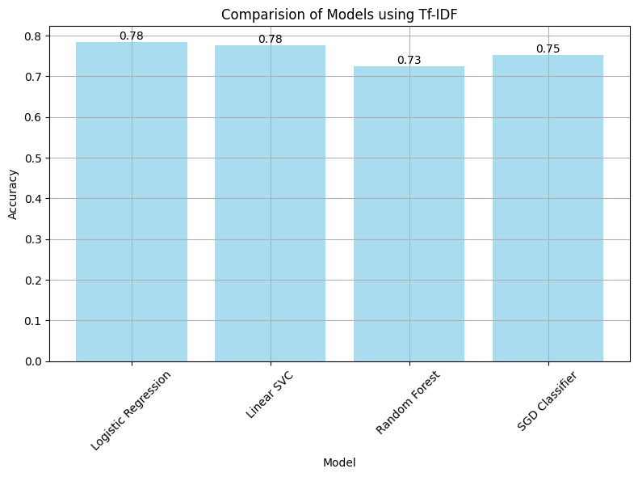
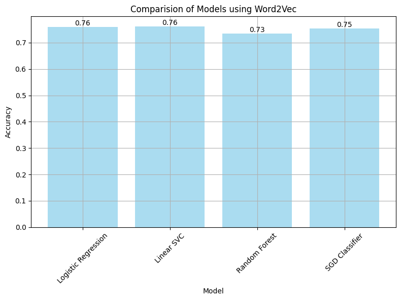
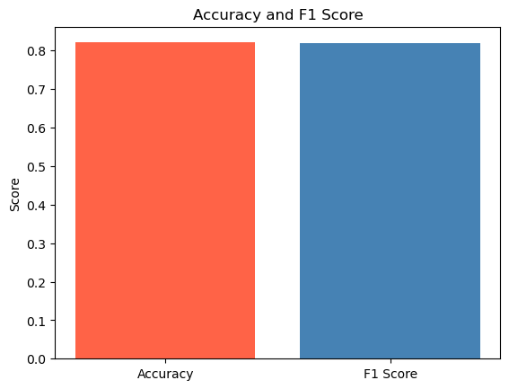
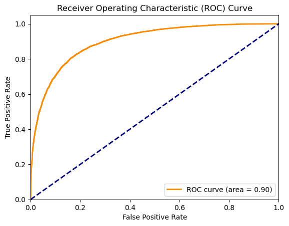

# Sentiment Analysis with TwitterSentiment140 Dataset

## Introduction

In this project, we perform sentiment analysis on the TwitterSentiment140 dataset, where we aim to understand the sentiments of users within their tweets. 

## Objective

The primary goal is to construct and evaluate supervised machine learning models for sentiment analysis. This is done through the process of data exploration, careful data processing and training/evaluation of the various models. 

## Methodology

- **Data Preprocessing:** Every tweet is cleansed, tokenized, and encoded. The tweets are vectorized using TF-IDF vectorizer and Word2Vec before training the models.

- **Model Training:** Four models namely; Logistic Regression, Linear SVC, Random Forest and SGD Classifier are trained on the refined dataset.
  
- **Performance Evaluation:** Made use of the accuracy, precision, recall, and F1-score evaluation metrices to gauge the effectiveness of each model.
  
- **Fine-Tuning BERT:** A deep learning approach using a pre-trained model for improved performance. The fine-tuned BERT model performed with an accuracy of 82%, 4% higher than the best trained machine learning model: LogisticRegression using Word2Vec with an accuracy of 78%.

## Results

## Acknowledgements

We extend our gratitude to the creators of the TwitterSentiment140 dataset and making it open source for the exploration of machine learning techniques.